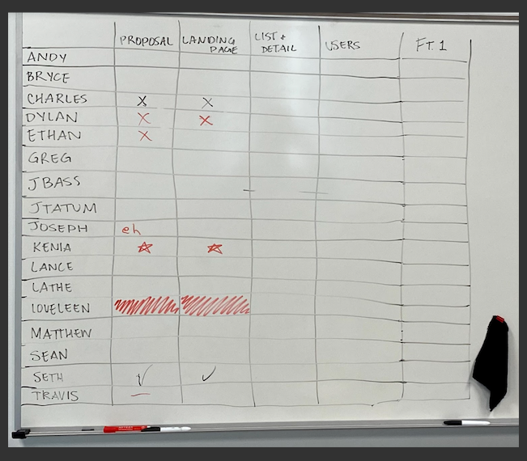

# Spring Proposal

### Description and Motivation
This project will be a chart that a Teacher can create where students can checked off of what they completed on the chart. 

- Students:  The students can join any of the charts that the Teacher created and checked off what they got done. The students can only see themselves in the chart and see the categories but can't see the other students.
- Teachers: The Teachers can see all the students in the chart and see what they checked off on the chart. The Teacher can confirm whether a student remains checked or not. 

My Motivations was the chart that we had on the board. We put a check mark right on the same line as are names. Here is a picture of what that looks like:

  

### Prior Art
We also do this on the board to make sure we know who's on which Milestone or Module. Putting this on a website will help us to be more organized of are workflow. 

#### Week 1 (Monday - Friday)
- Study/Practice Spring to make sure that I know what to do.
- Then Start working the Initial Setup and Landing Page on MileStone 1.Make the project connect to github and make landing page.
- Make sure that the landing page is high-level detail.
- Start working on my unit project and add the basic of framwork which is the html, static and database.
#### Week 2 (Monday - Friday)
- Make templates that has multiple pages and add a database. 
- Create and configure SQL migrations and initial data. 
- Then list the students or teachers, also the charts being post.
- Create the post about the charts
#### Week 3 (Monday - Friday)
- Create the sign up page, login page, and logout. 
- Have a Spring Security that handles the passwords management. 
- Add the Service, Entity, and Repository for each user.
#### Week 4 (Monday - Friday)
- Make sure there's no bugs
- Meet the requirements on Milestone 3
- Then after that I will put more features like if there was more than one teacher and they have their own rooms.
#### Week 5 (Tuesday - Friday)
- Continue working on the feature where there are multiple teachers.
- Debug any erros 
- Practice presentation
